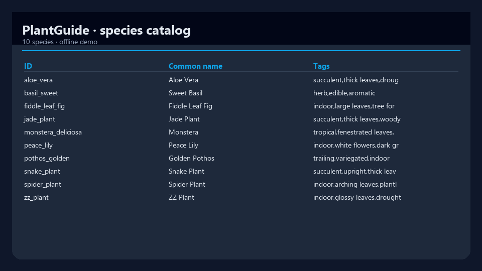
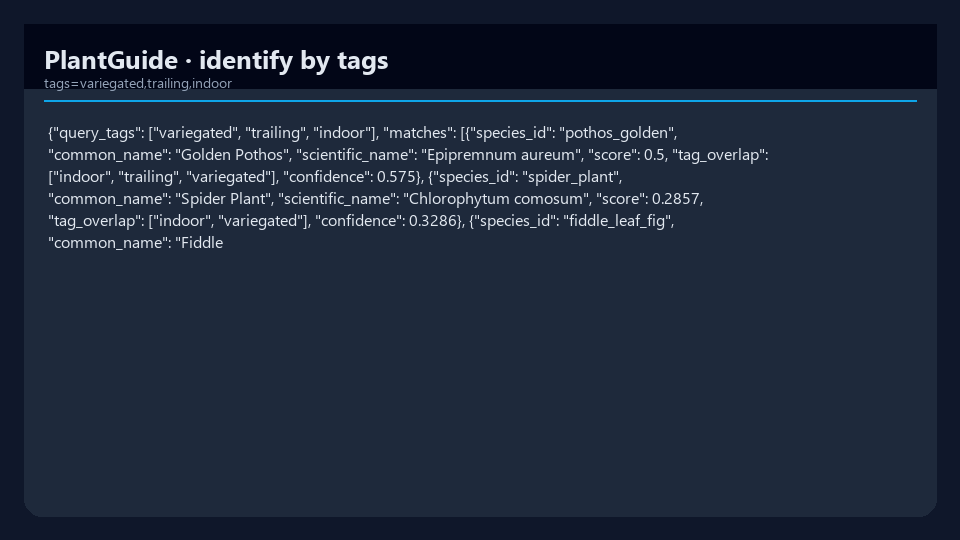
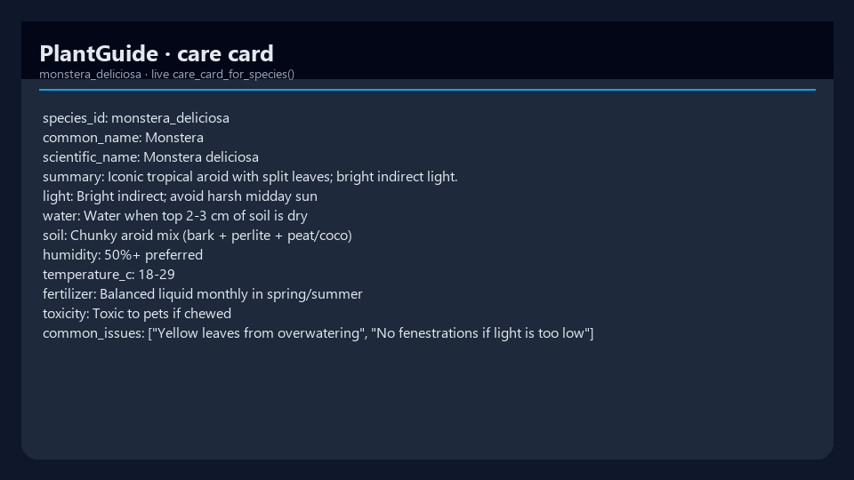

# PlantGuide

**PlantGuide** is a training and inference toolkit for **plant identification** and **species care guidance**:

| Mode | Description |
| --- | --- |
| **Identify** | Traits / tags / (later) photo → ranked species |
| **Care** | Per-species watering, light, soil, humidity, common issues |
| **App SDK** | JSON reports for gardening / plant-care apps |

Built under [mergeos-bounties](https://github.com/mergeos-bounties) so delivery can be funded as MergeOS tasks with MRG payouts.


## Screenshots

Real captures from running the product demo (PlantGuide).



*Species catalog*



*Identify by tags*



*Care card (Monstera)*

## Stack

- Python 3.11+
- CLI: `typer` + `rich`
- Species catalog (JSON) + toy trait matcher
- Optional vision / torch / FastAPI extras via bounties

## Quick start

```bash
cd PlantGuide
python -m venv .venv

# Windows
.venv\Scripts\activate

pip install -e ".[dev]"
plantguide --help
```

## Commands

```bash
plantguide version
plantguide species list
plantguide identify tags --tags "succulent,thick leaves,drought"
plantguide identify sample --file data/samples/monstera_traits.json
plantguide care show --species monstera_deliciosa
plantguide train toy --epochs 3
plantguide train report
```

## Layout

```
src/plantguide/
  cli.py
  config.py
  data/           # loaders
  models/         # toy identifier
  identify/       # pipelines
  care/           # care card builders
  train/
  integrations/   # app SDK
  api/
data/species/     # plant catalog + care profiles
data/samples/     # trait observation fixtures
docs/BOUNTY.md
```

## MergeOS bounties

1. Star this repo + [mergeos](https://github.com/mergeos-bounties/mergeos)
2. Claim an issue labeled `bounty` / `species-pack`
3. Also claim on MergeOS [issue #1](https://github.com/mergeos-bounties/mergeos/issues/1)
4. Open a PR to **this public repo** with tests/evidence
5. Maintainer merges and credits MRG (25/50/100/200)

### Guides in all languages

Step-by-step claim + photo pack instructions:

**[docs/guides/README.md](docs/guides/README.md)** — EN · VI · 中文 · 日本語 · 한국어 · ES · FR · DE · PT · ID · TH · HI · AR · RU

Policy: [docs/BOUNTY.md](docs/BOUNTY.md) · Species issues: [label:species-pack](https://github.com/mergeos-bounties/PlantGuide/issues?q=is%3Aissue+is%3Aopen+label%3Aspecies-pack)

### Maintainer PR loop

```bash
node scripts/pr_maintainer_loop.mjs
node scripts/pr_maintainer_loop.mjs --dry-run
```

## Privacy & safety

- Prefer consented photos and public botanical datasets with clear licenses.
- Care tips are educational, not medical advice for toxic plant exposure.
- Document dataset licenses in every PR that adds data.

## License

MIT
